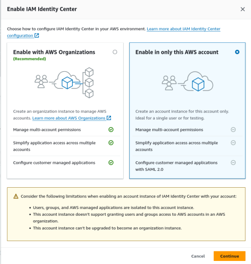

# Vide's DevOps exercise

This is my implementation of what requested for the exercise. You can find the initial statement in [REQUIREMENTS.md](REQUIREMENTS.md)

You can find some insights on the decision-making process and the tradeoffs and issues I faced in [DECISIONS.md](DECISIONS.md)

# Bootstrapping the exercise

## Prerequisites 

### AWS CLI

You can install it with [Homebrew](https://brew.sh/) under Linux/MacOS, use your distribution resources in Linux or follow the [official AWS installation guide](https://docs.aws.amazon.com/cli/latest/userguide/getting-started-install.html).
If you use Homebrew you can install it with:

```bash
$ brew install awscli
```

### `make`

Make should be already present in any POSIX platform, even on Windows with WSL2 installed.
Check the [`Makefile`](Makefile) for more details about what's available.

### `tfenv` (optional)

You can use [`tfenv`](https://github.com/tfutils/tfenv) to install and manage Terraform installation and version pinning.
If you use Homebrew you can install it with:

```bash
$ brew install tfenv
```

and then install the right Terraform version in this repo with:

```bash
$ tfenv install
```

### `direnv` *(optional)*

You can use [`direnv`](https://github.com/direnv/direnv) to dynamically load environment variables in a project directory
If you use Homebrew you can install it with:

```bash
$ brew install direnv
```

### `pre-commit` framework *(optional)*

[`pre-commit`](https://pre-commit.com/#install) is optional but highly reccommended, since it automatically manages the Terraform Docs installation and generation with pre-commit hooks, so you don't have to think about regenerating it each time.

If you use Homebrew you can install it with:

```bash
$ brew install pre-commit
```

and then run

```bash
$ make install_precommits
```

Once installed, everytime some file that Terraform Docs is "watching" changes, it will regenerate automatically the managed documentation, that you can review and then commit for good.

### AWS Root Account creation

*If you already have a spare, standalone AWS account that can be used as the root account for the new organization, skip this part.*

Register a new AWS standalone account. For this you will need:
1. a valid email address for the root user
2. a valid telephone number to complete the CAPTCHA
3. a valid credit/debit card :money_with_wings:

## The actual bootstrap process

### Programmatic account setup

1. Login into the account web console
2. 🤦🏻 ClickOps alert! 🤦🏻 Enable the AWS IAM Identity Center feature. This can be only done manually even according to the [`identity-center-with-terraform` module by AWS](https://github.com/aws-samples/identity-center-with-terraform?tab=readme-ov-file#prerequisites). **Remember to use the region you will use with Terraform! By default, `eu-west-1`**
   1. This, in turn, will force you to enable AWS Orgs in the UI as well, forcing us to import it later in Terraform.
   2. 
   3. Choose the **Enable with AWS Organizations**
3. Create a super-admin user in the [IAM Identity Center](https://eu-west-1.console.aws.amazon.com/singlesignon/home?region=eu-west-1#!/instances/68048cb1c0550830/dashboard) with programmatic access and SSO, following AWS best practices.
   1.  [Create a group](https://eu-west-1.console.aws.amazon.com/singlesignon/home?region=eu-west-1#!/instances/68048cb1c0550830/groups) and call it, for example, `superadmins`
   2.  [Create an user](https://eu-west-1.console.aws.amazon.com/singlesignon/home?region=eu-west-1#!/instances/68048cb1c0550830/users) and call it, for example, `superadmin`. Put a valid email address (:warning: you will get an **activation email** there!) and follow the creation instructions. Add it to the `superadmins` group.
   3.  Create a `superadmin` [permission set](https://eu-west-1.console.aws.amazon.com/singlesignon/organization/home?region=eu-west-1#/instances/68048cb1c0550830/permission-sets), assigning the AWS Managed policy [`AdministratorAccess`](https://us-east-1.console.aws.amazon.com/iam/home?region=eu-west-1#/policies/details/arn%3Aaws%3Aiam%3A%3Aaws%3Apolicy%2FAdministratorAccess)
   4.  Go to the [AWS Accounts subpage](https://eu-west-1.console.aws.amazon.com/singlesignon/organization/home?region=eu-west-1#/instances/68048cb1c0550830/accounts), select the root (management) account and click "Assign users or group". Assign the `superadmins` group you have created.
4.  Now you can follow the activation email for the `superadmin` account. When logging in for the first time, instead of going to the web console, click on the `Access keys` link, and note down the `SSO start URL` and `SSO Region` values.
5.  Run `aws --profile exercise-root-superadmin configure sso` in a terminal. This will create a dedicated AWS CLI profile called `exercise-root-superadmin` with all needed for SSO access. Follow the instructions on screen and refer to the AWS CLI official guide for more help, if needed.

> 🗒️ Another option, following the "legacy" users and groups with static access keys, it's to skip the SSO user creation and instead create the superadmin as a classic user, and then generate the static access keys for it and save them in your AWS SDK config directory (`~/.aws`). This works as well but AWS is pushing hard to stop people using it, because it's less secure. But if you know what you do and you are sure about it, go ahead.

### Terraform bootstrap

If you have `direnv`, run:
```
$ echo "export AWS_PROFILE=exercise-root-superadmin" > .envrc
$ direnv allow .
```

otherwise, remember to run
```
export AWS_PROFILE=exercise-root-superadmin
```

at least once before running Terraform.

Now you need to import the Org ID created in the web console. Run

```
$ make import_organization
```

It will exit with return status 0 if everything is OK. If it doesn't, you are probably not correctly authenticated or maybe there is some issue with the AWS region settings.

You can now run

```
$ terraform plan
$ terraform apply
```

:warning: Since this is a "simple" exercise, it uses by default a local statefile (which is gitignored). Obviously this is NOT OPTIMAL for a real world usage (i.e. everything above a single user running it from their machine).

# Usage example

The real meat is in `main.tf`, in the `accounts` parameter when calling the [`onboarding`](modules/onboarding/README.md) module.


```hcl
module "account_onboarding" {
  source = "./modules/onboarding"
  accounts = [{
    name = "YourNewAccountName"
    email       = "owner@example.com"
    domain_name = "example2.com"
    dns_records = [{
      name    = "foo"
      records = ["1.1.1.1"]
      ttl     = 3600
      type    = "A"
    }]
  },
  {
    name = "AnotherAccount"
    email       = "another_owner@example.com"
    domain_name = "localdomain"
    dns_records = [{
      name    = "bar"
      records = ["foobar"]
      ttl     = 3600
      type    = "TXT"
    }]
  }
  ]
}
```

You can specify multiple accounts, and in each account you can specify multiple DNS records to be created.